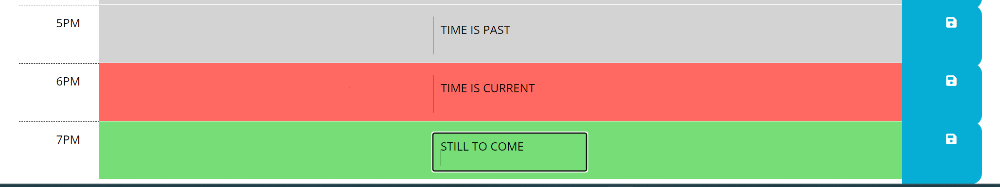

# Work Day Scheduler

A simple and intuitive calendar application that allows users to save events for each hour of the day. This application is designed to help busy professionals manage their time more effectively.

## Features

- **Dynamic Date & Time:** Displays the current day at the top of the calendar.
- **Timeblocks:** Presents timeblocks for standard business hours.
- **Color-coded Timeblocks:** Each timeblock is color-coded to indicate whether it's in the past, present, or future.
- **Event Saving:** Allows users to enter and save an event for each timeblock.
- **Data Persistence:** Events persist even after refreshing the page, thanks to local storage.

## Live Application

Access the live application [here](https://bh1ff.github.io/WorkDayScheduler/).

## Repository

All the code for this project is available on GitHub. You can access and fork the repository [here](https://github.com/bh1ff/WorkDayScheduler).

## Getting Started

1. Clone the repository: `git clone https://github.com/bh1ff/WorkDayScheduler.git`
2. Open `index.html` in your preferred browser.

## Feedback & Contribution

Pull requests are welcome. For major changes, please open an issue first to discuss what you would like to change.

## Contact

For any feedback or questions, feel free to reach out to me:
- Email: [a.ayad@robocode.uk](mailto:a.ayad@robocode.uk)

## License

This project is open source and available under the [MIT License](LICENSE).
